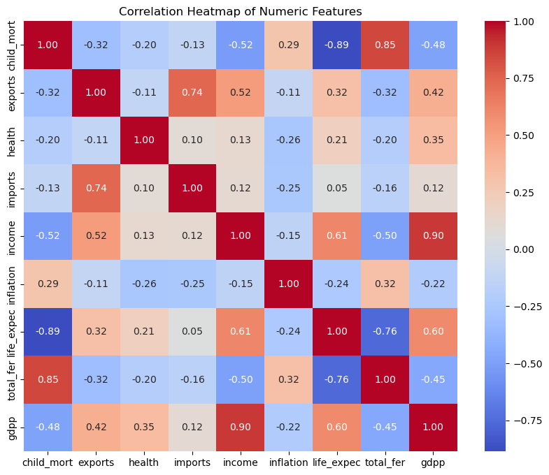
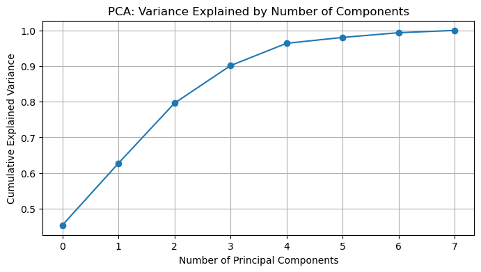
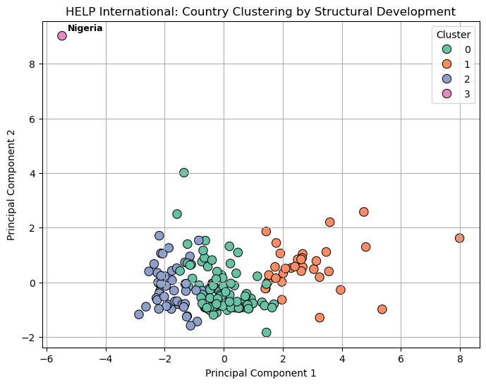
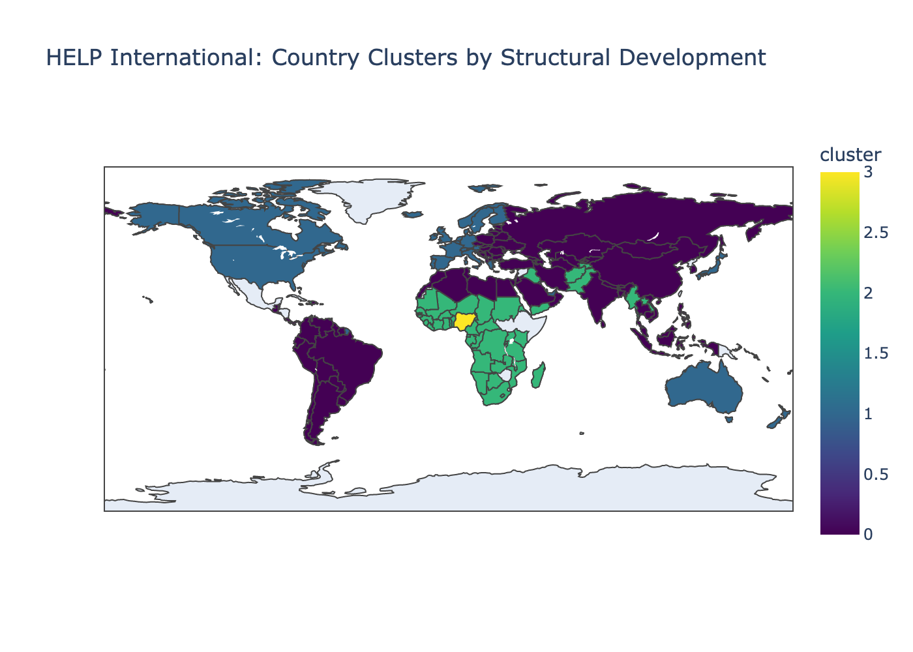

# 🌍 HELP International: Country Clustering for Aid Allocation

This project supports **HELP International**, a global NGO aiming to **allocate $10 million in aid** effectively across countries in need. Using **unsupervised machine learning**, the analysis clusters countries based on key socio-economic and health indicators to identify regions that would benefit most from targeted aid.

---

## 📊 Executive Summary

HELP International faces a common global dilemma: **limited resources, unlimited need**. This project introduces a **vulnerability modeling framework** that groups countries by **structural similarities** in their economic, health, and demographic indicators.

By identifying **four distinct country clusters**, the model provides HELP International with a **data-backed roadmap** for distributing funds ethically, efficiently, and with maximum impact.

---

## 🎯 Project Goals
- Identify **natural groupings** of countries based on development indicators.
- Highlight **most structurally vulnerable clusters** for prioritized funding.
- Support **data-driven, ethical decision-making** in global aid allocation.

---

## 📂 Project Structure

```
help-international-analysis/
├── data/             # Raw and cleaned datasets
├── sql/              # SQL scripts (table creation, insert statements)
├── notebooks/        # Jupyter Notebooks for analysis
├── powerbi/          # Power BI dashboards and reports
├── README.md         # Project overview (this file)
```

---

## 📂 Dataset
- **Source**: [Kaggle – Country Data](https://www.kaggle.com) *(5 years old; used for modeling demonstration)*
- **Size**: 167 countries
- **Key Features**:
  - `child_mort` – Under-5 mortality rate
  - `health` – % GDP spent on health
  - `gdpp` – GDP per capita
  - `life_expec` – Life expectancy (years)
  - `total_fer` – Fertility rate (births per woman)
  - `inflation`, `imports`, `exports`, `income`

---

## 🧪 Methodology

**Workflow**:
1. **Data Source & Loading** – Downloaded dataset from Kaggle as a CSV file and loaded it into Jupyter using pandas for cleaning and analysis.
2. **Exploratory Data Analysis (EDA)** – Distributions, outlier checks, and correlation heatmaps in Python.
3. **Feature Scaling** – Used `RobustScaler` to normalize variables.
4. **Dimensionality Reduction** – Applied **PCA** to retain 96% variance with 4 components.
5. **Clustering** – Tested multiple `k` values with Elbow and Silhouette methods; selected **k = 4**.
6. **Interpretation** – Profiled each cluster’s socio-economic and health characteristics.
7. **Strategic Recommendation** – Prioritized funding to most vulnerable clusters.

---

## 🧩 Key Findings

| Cluster | Profile | Aid Priority |
|---------|---------|--------------|
| **2** | Highest child mortality, lowest GDP, low life expectancy | **Urgent** |
| **0** | Moderate development, still fragile | **Targeted growth investment** |
| **1** | High-income, high life expectancy | **No aid; potential partners** |
| **3** | Outlier with extreme instability | **Special case** |

---

## 🧭 Final Aid Strategy Recommendation

- **Cluster 2**: Allocate **majority of $10M** for urgent short-term relief and long-term infrastructure support.  
- **Cluster 0**: Invest in education, healthcare systems, and climate resilience projects.  
- **Cluster 1**: Engage as development partners or co-funders.  
- **Cluster 3**: Address via emergency humanitarian coordination.

---

## 📈 Sample Visualizations

**Correlation Heatmap** – Highlights relationships between key socio-economic and health indicators, revealing strong positive correlation between `income` and `gdpp`.  


**PCA Variance Explained** – Shows how the first four principal components capture 96% of the dataset’s variance, reducing dimensionality while preserving insight.  


**Cluster Scatter Plot** – 2D visualization of country groupings after clustering, revealing four distinct structural development profiles.  


**Choropleth Map** – Geographic distribution of clusters, providing a global view of how structural development profiles are spread across countries.  


---

## 🛠 Tools & Technologies
- **Data Storage**: PostgreSQL (via DBeaver)
- **Data Processing & Modeling**: Python (`pandas`, `scikit-learn`, `matplotlib`, `seaborn`)
- **Clustering**: K-Means, Hierarchical (evaluation only)
- **Visualization**: Power BI, Plotly, Matplotlib/Seaborn
- **Version Control**: Git & GitHub

---

## 🚧 Limitations
- Dataset is 5 years old and does not reflect current geopolitical crises.
- Indicators are weighted equally; future iterations could apply **vulnerability weights**.
- No integration of conflict, refugee displacement, or climate risk layers.

---

## 🔮 Future Work
- Integrate real-time or annually updated development indicators.
- Add **geospatial visualizations** for better policy communication.
- Develop a **dashboard for donor engagement** (static or interactive).

---

## 📬 Contact

**Alyssa Day**  
B.S. Data Science | UNC Charlotte  
📧 alyssaday2003@gmail.com  
🔗 [LinkedIn](https://www.linkedin.com/in/alyssaday01)
